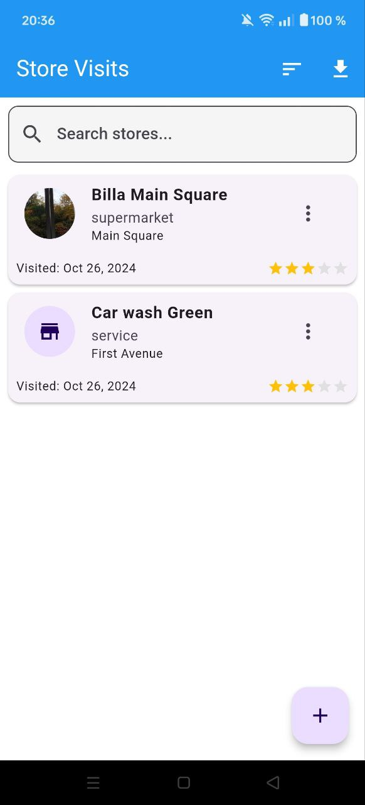

# Visilog - Store Visit Management App

A professional Flutter application designed for sales representatives and business developers to efficiently document and manage their store visits.

## Download

📱 You can download the latest APK from the [Releases](https://github.com/Sinamirshahi/visilog/releases) section.

## Features

✨ Key Features:
- 📸 Store photo documentation
- 📍 GPS location tracking
- 📝 Detailed store information
- 📅 Visit date tracking
- 🔄 Follow-up scheduling
- 📊 Partnership potential rating
- 💾 Offline functionality
- 📤 Export to Excel
- 🌐 Multilingual support

## Store Information Tracking
- Store name and type
- Contact information
- Business hours
- Location coordinates
- Visit history
- Follow-up dates
- Partnership ratings
- Custom notes

## Technical Details
Built with:
- Flutter
- Provider for state management
- Local storage with SharedPreferences
- GPS location services
- Excel export capability
- Image capture and storage

## Installation

1. Download the APK from [Releases](https://github.com/Sinamirshahi/visilog/releases)
2. Enable "Install from Unknown Sources" in your Android settings
3. Install the APK
4. Grant required permissions when prompted

## Privacy

This app:
- Works completely offline
- Stores data locally on your device
- Requires camera and location permissions
- No data is sent to external servers

## Contributing

Pull requests are welcome. For major changes, please open an issue first.

## License

[MIT](https://choosealicense.com/licenses/mit/)